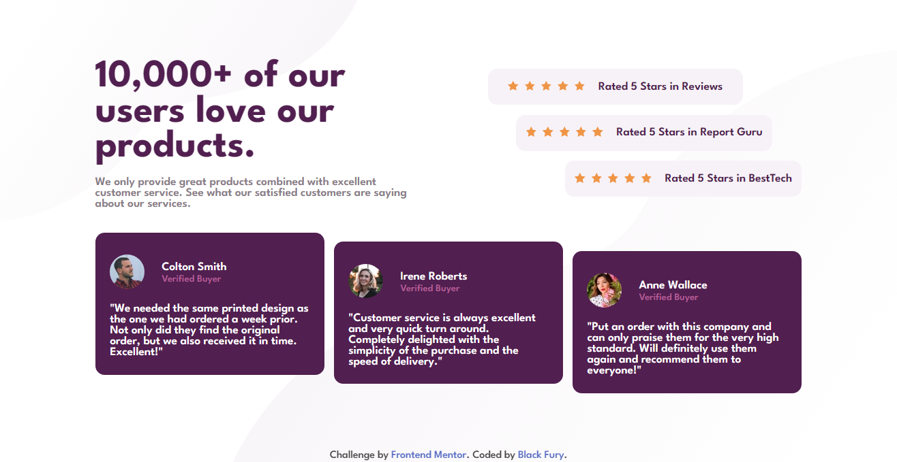

# Frontend Mentor Challenge | Social-proof-section

This is the solution to the [Social proof section challenge on Frontend Mentor](https://www.frontendmentor.io/solutions/build-a-social-proof-section-using-html-css-flexbox-css-grid-2-XqkEQyM8). Frontend Mentor challenges help us to improve our coding skills by building realistic projects.   

## Built with

- Semantic HTML5 markup
- CSS custom properties
- Flexbox
- CSS Grid
- Mobile-first workflow

Preview it here - [Social proof section](https://id-dev3.github.io/Social-proof-section/)   

## Author

- Website - [Black Fury](https://id-dev3.github.io/)
- Frontend Mentor - [@BlackFury117](https://www.frontendmentor.io/profile/BlackFury117)
- Twitter - [@id_dev3](https://twitter.com/id_dev3)
